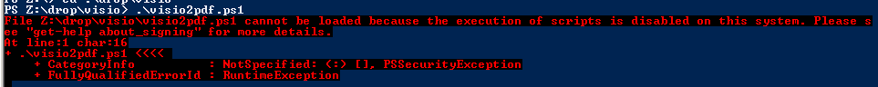

# powershell
If you haven't run any PS scripts on your machine before, you'll get an annoying error message:


Open a Powershell and issue the command
```
Set-ExecutionPolicy -scope CurrentUser RemoteSigned
```
to allow locally created scripts to execute.


## visio2pdf.ps1
Parameters: one or more visio documents (default: `*.vsdx`)
Loads each document, crops page down to fit contents and exports to PDF in print quality.
